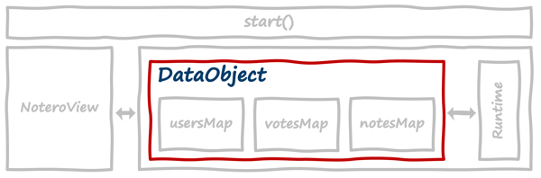
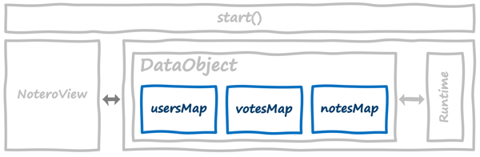
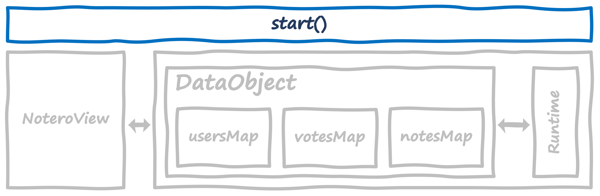
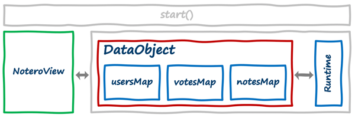

### 1. Extend DataObject (src/fluid-object/main.ts)

* Container for distributed data structures (DDSes).



### 2. Define Properties

* See https://fluidframework.com/docs/concepts/dds/#picking-the-right-data-structure for additional DDSes.
* DDSes/runtime ensure proper order as users contribute notes, votes, etc. Changes across clients are automatically handled.



```typescript
private notesMap: SharedMap;
private votesMap: SharedMap;
private usersMap: SharedMap;
```

### 3. Create Helper Function

* Used to create SharedMap objects which hook to the runtime.

```typescript
private createSharedMap(id: string): void {
    const map = SharedMap.create(this.runtime);
    this.root.set(id, map.handle);
}
```

### 4. Create SharedMap Objects

```typescript
this.createSharedMap("notes");
this.createSharedMap("votes");
this.createSharedMap("users");
```

### 5. Assign Local References of SharedMap Objects

* Runs everytime client joins. Attach local props to created SharedMaps

```typescript
this.notesMap = await this.root.get<IFluidHandle<SharedMap>>("notes").get();
this.votesMap = await this.root.get<IFluidHandle<SharedMap>>("votes").get();
this.usersMap = await this.root.get<IFluidHandle<SharedMap>>("users").get();
```

### 6. Create Event Listeners Helper

```typescript
private createEventListeners(sharedMap: SharedMap): void {
    // Set up an event listener for changes to values in the SharedMap
    sharedMap.on("valueChanged", () => {
        this.emit("change");
    });
}
```

### 7. Pass DataObject (Model) to View Props (src/app.tsx)

Pass the DataObject with the SharedMaps into the NoteroView component.



```typescript
function start() {

    ... 

    ReactDOM.render(
        <NoteroView model={defaultObject} />,
        document.getElementById("content"));
}
```

### 8. Use the Model Object Functionality in the Component (src/NoteroView.tsx)

The view can interact with the different functionality of the 
DataObject/Model as it would any standard object.



```typescript
return (
  <div>
    <Pad
      createNote={props.model.createNote}
      demo={props.model.createDemoNote}
      user={state.user}
      users={state.users}
      setHighlightMine={setHighlightMine}
      highlightMine={highlightMine}
    />
    <Board
      notes={state.notes}
      vote={props.model.vote}
      user={state.user}
      highlightMine={highlightMine}
    />
  </div>
);
```